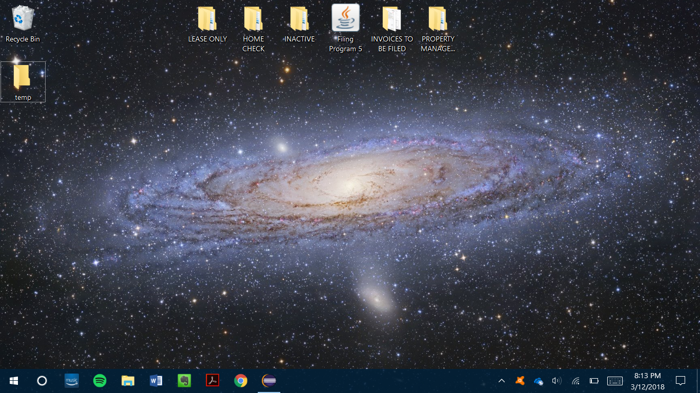
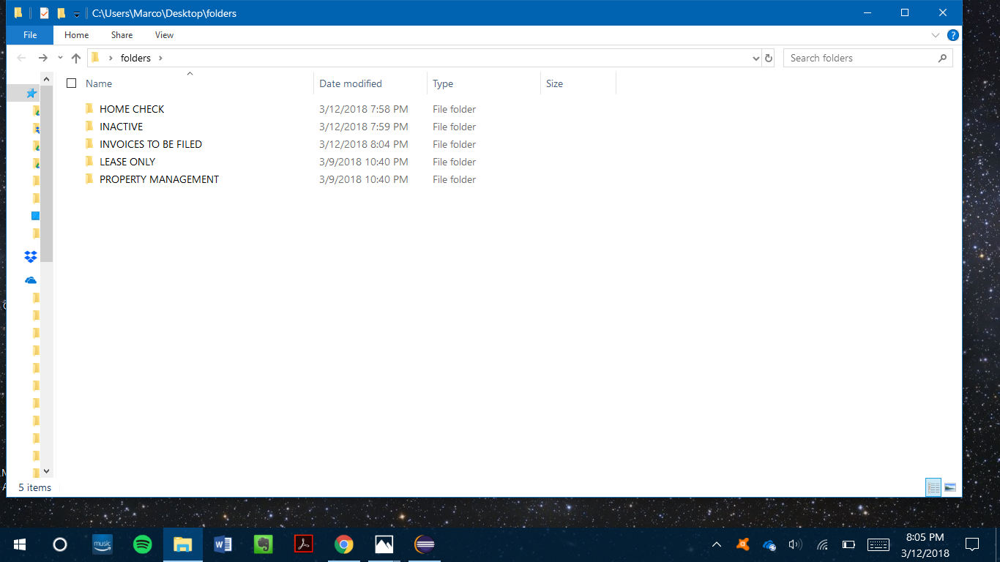
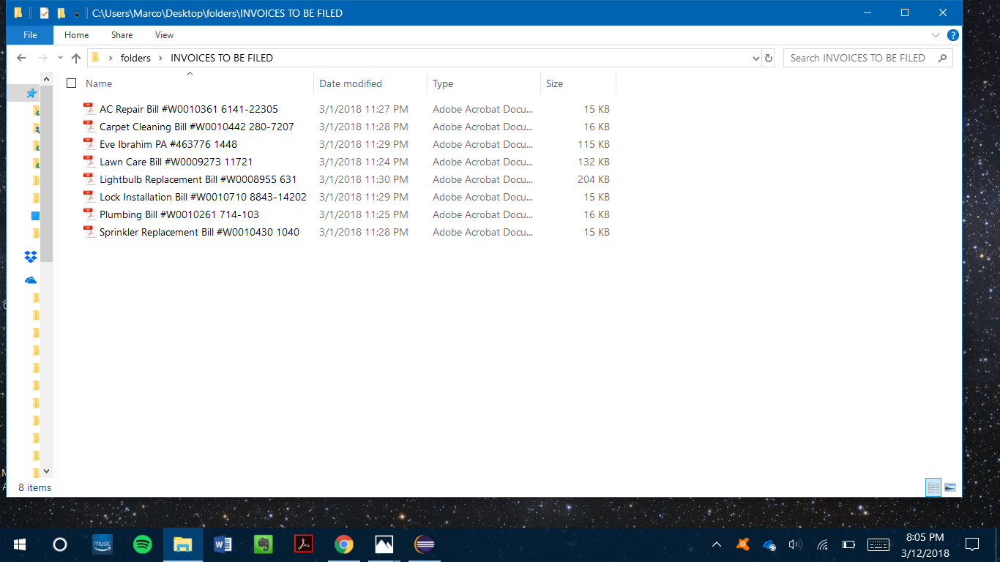
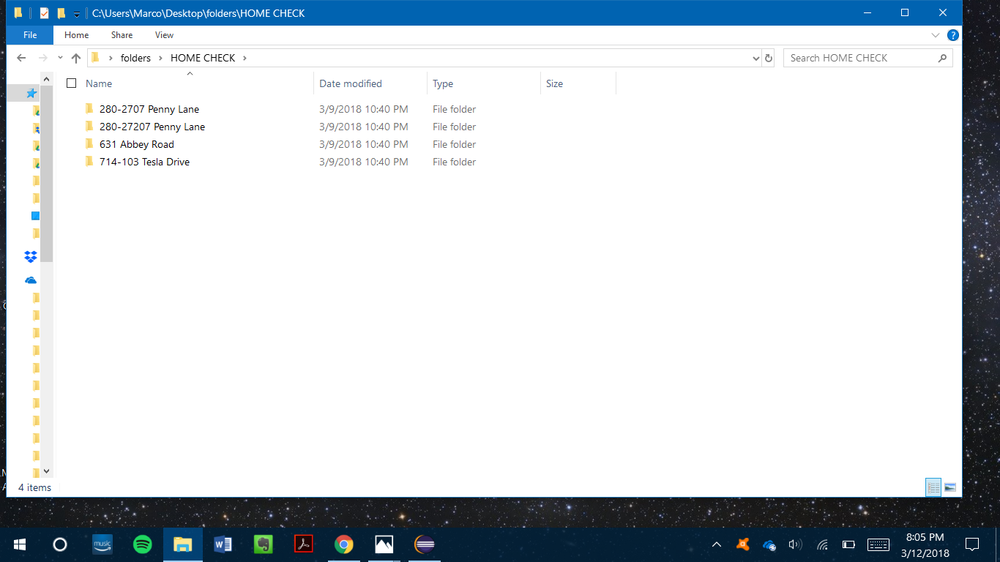
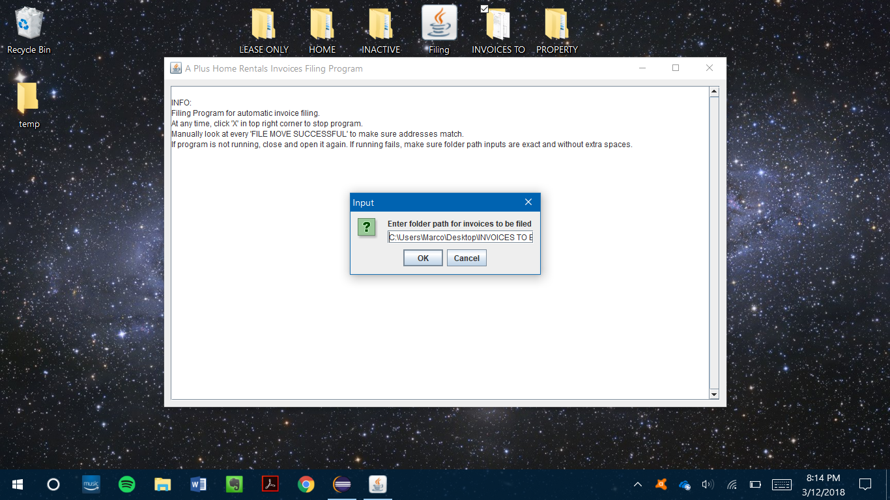
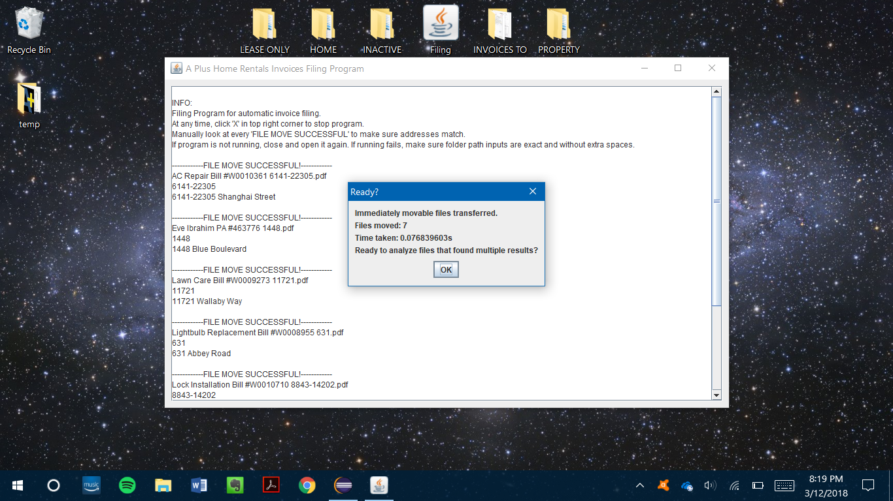
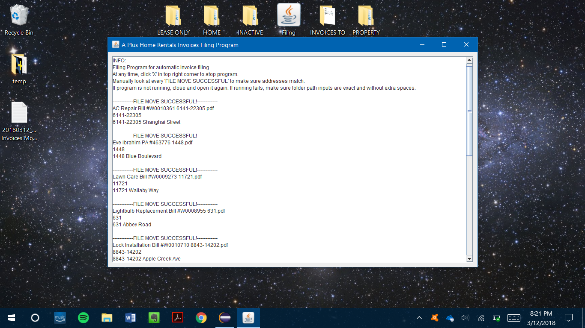
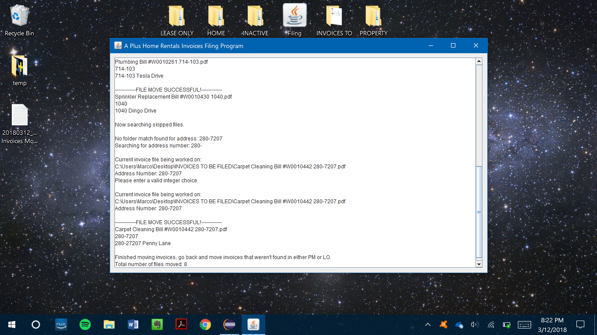
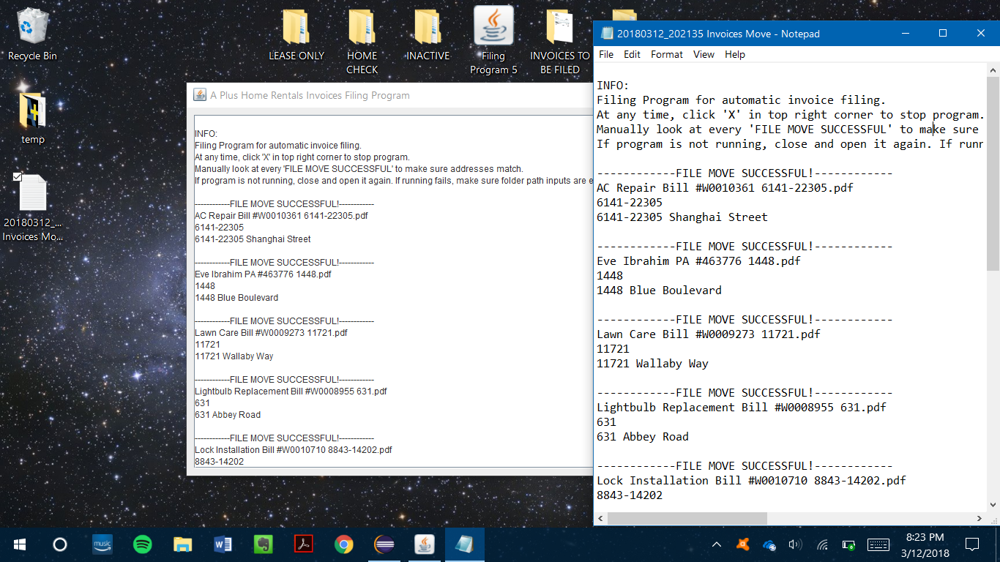

# FilingProgram
A Plus Home Rentals is a rentals and property management company I worked for previously. They manage over 200 homes, and with each of those homes receiving multiple monthly bills that A Plus must record such as lawncare, poolcare, etc, the amount of files quickly adds up. I was tasked with moving each bill to their corresponding address folders simply by clicking and dragging. This, to me, was tedious and inefficient, so I decided to create a filing program to move the files automatically. In the program, each file is moved according to address number. All moves are shown to the user, and if there are multiple potential folders found, the program opens the pdf file for the user to analyze and then is given the option to decide where said file should go. All moves are printed out and saved as a .txt file after the program finishes for safekeeping.

          
